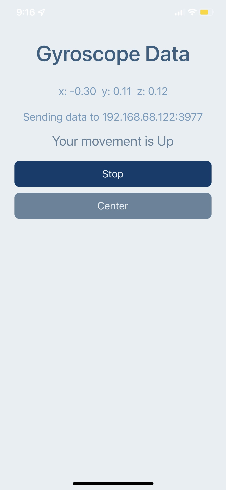
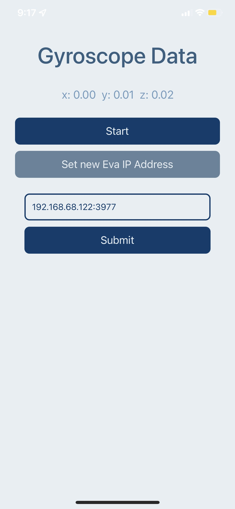
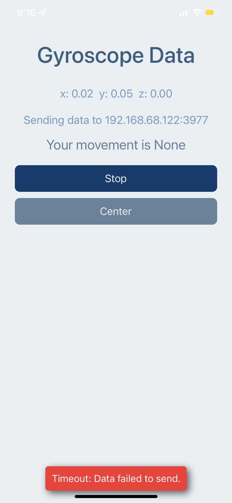

# EvaGyroscope

**Description**

Mobile app developed with Expo and React Native for the head movement of Eva.

**Screenshots**

    
    
    

**Prerequisites**

Be sure that you have already installed:
- NodeJs and Yarn.
- Expo js.
- Git.
- Expo Go app in a smartphone.

**Instructions**

- run in your git console `git clone https://github.com/fimbres/EvaGyroscope.git`
- run `cd EvaGyroscope`
- run  `yarn install` or just `yarn`
- Open the project with your IDE.
- run `expo start`
- scan the QR code using your smartphone. (this should open your Expo Go app with the EvaGyroscope running on your smartphone)
